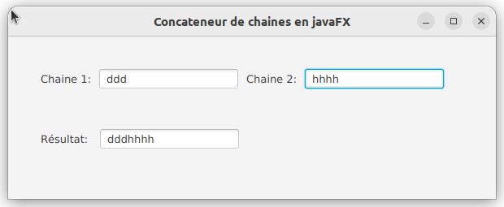
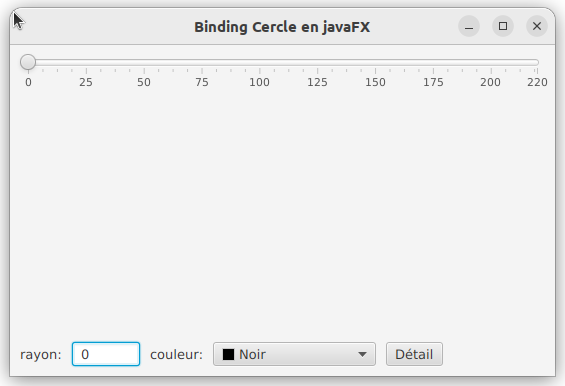
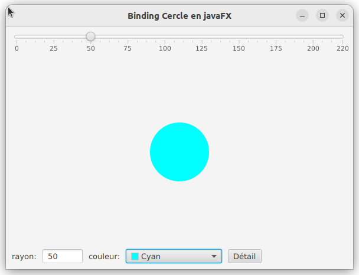
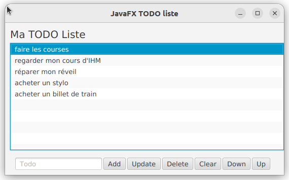

# 
 TD6 de javaFx: Binding 

## EXERCICE 1:

En vous inspirant de l’exemple du cours concernant l’application qui calcule la somme de deux nombres (en utilisant le binding), réalisez une application qui comporte deux *TextField* où seront saisies des données par l’utilisateur. 
Le contenu des deux *TextField* précédents sont concaténés et le résultat est recopié à la volée dans un troisième *TextField*.  

Le contrôleur via sa méthode *bindVue(…)* permet de mettre en place le binding entre les éléments de la vue. 
Pour écrire cette méthode, posez vous la question, qui est lié à quoi et dans quelle direction.
Il ne faut pas écrire d’écouteur. Il n’y a pas de modèle.
Par rapport à l’exemple du cours, vous n’avez pas besoin de réaliser une conversion pour le binding des *TextField* car ils sont de même type.

> Si vous rencontrez des difficultés, commencez par lier le premier *TextField* à celui qui est dessous (Résultat).
> Lorsqu’on tape un caractère dans le premier il est copié à la volée dans le second.

## EXERCICE 2:

Vous disposez dans le projet de la classe *Vue* que vous ne devez pas modifier.

### 1) Lancement de l'application

Complétez la classe *MainCercle* afin de pouvoir lancer l’application. 
Pour l’instant, n’instanciez ni de contrôleur et ni de modèle. 
Vous allez obtenir le rendu suivant:

Vous pouvez utiliser l’application: 
- modifier la valeur du Slider
- utiliser le ColorPicker
- entrer une valeur dans le TextField 

Mais il ne se passe pas grand-chose pour l’instant. 
Votre travail consistera à permettre l’affichage d’un cercle en fonction des valeurs définies via l’interface.

En étudiant le code de la vue vous remarquerez que:
- un *TextFormatter* a été utilisé pour filtrer les caractères saisis dans le *TextField*. 
On ne peut entrer que des nombres compris entre 0 et la valeur maximale indexée sur le *Slider* (ici 220).
- un objet de type *Circle* devrait s’afficher au centre du *BorderPane* mais son rayon étant égal à 0, il n’est pas visible.

Voici ci-dessous ce que vous devrez obtenir:

### 2) Développement de l'application

Nous allons réaliser le développement pas à pas.  
Vous allez apporter des modifications au modèle *Cercle* et au contrôleur *ControleurBinding*. 
Nous n’utiliserons que du binding entre propriété.

a) Lorsque la valeur du *Slider* est modifiée, le cercle doit se dessiner avec  comme rayon celui défini via le *Slider*. 
Pour ceci, Il faut chercher dans la documentation de la classe *Circle* et dans celle de la classe *Slider* quelles propriétés (*property*) de ces classes il faut utiliser.
Vous passerez par l’intermédiaire d’un attribut du modèle qui sera de type *SimpleIntegerProperty* que vous définirez pour réaliser le binding.  Le binding est mis en place dans la méthode *bindModeleVue(…)* du *ControleurBinding*.
N’oubliez pas aussi de modifier *MainCercle* pour que cette fonctionnalité soit prise en compte (instanciation du modèle, de la vue et du contrôleur et mise en place du binding)

b) Lorsqu’une valeur est saisie dans le *TextField* alors le cercle est dessiné avec un rayon qui prend cette même valeur. La valeur du *Slider* est aussi modifiée en conséquence. 
Quand la valeur du rayon est modifiée via le *Slider*, la valeur dans le *TextField* doit aussi être modifiée. Il faut pour réaliser le binding que vous passiez par l'intermédiaire du modèle.
Vous aurez à réaliser lors d’un binding, une conversion de type. Vous avez un exemple dans le cours (la calculatrice).

Maintenant, à l’ouverture de l’application, le cercle doit avoir un rayon de 50. Si tout est bien écrit, il suffit simplement dans le contrôleur *ControleurBinding* de valuer le rayon du modèle à 50.

c) On veut maintenant que lorsqu’une couleur est choisie dans le *ColorPicker*, le cercle se colorie dans cette couleur.
Mettez à jour le contrôleur *ControleurBinding* en passant encore via un attribut du modèle qu’il faudra définir.

d) Faites une modification dans la vue: associer au centre du *BorderPane* principal le panneau nommé *panelCentre*
> *this.center=panelCentre* au lieu de *this.center=this.cercle* à la fin du code de la vue

Le cercle maintenant s'affiche en haut à gauche du *panelCentre* et son centre est en 0,0

Travail: on veut maintenant que le cercle se dessine toujours au centre de *panelCentre* quand la fenêtre de l’application est redimensionnée. 

e) Nous allons développer le contrôleur *ControleurBoutonDetail* de manière classique (pas de binding). Lorsque le bouton sera cliqué, une fenêtre de dialogue de type information (*Alert*) s’ouvrira et donnera des informations sur le cercle: son rayon, sa couleur, son périmètre et sa surface. 
Développez les méthodes *surface(…)* et *perimetre(…)* dans le modèle.

## EXERCICE 3:

Vous allez développer une TODO liste en javaFX à l’aide de la classe *ListView*. 
Cette classe a été vue à la fin du cours. 
Sa spécificité est que si elle est liée à un objet de type *ObservableList* alors toute modification réalisée dans cette liste est répercutée sur la *ListView* et réciproquement.

Le modèle et la vue vous sont fournis.

### 1) Mise en place de l'affichage

Lire le code du modèle et de la vue pour les comprendre avant de mettre en place les contrôleurs. 
Développez la méthode *start()* de la classe *MainTodoListe* qui permettra d’obtenir l’affichage ci-dessous.

### 2) Développement des contrôleurs

> Vous testerez bien tous les cas limites

a) lorsqu’un élément de la liste est cliqué, l’item de la liste s’affiche dans le *TextField*.  => **ControleurTodoList**

b) lorsqu’on clique sur le bouton "Add", si la valeur dans le *TextField* est non vide alors un nouvel item est ajouté en fin de la liste et le *TextField* est ensuite remis à vide. => **ControleurAddButton**

c) lorsqu’on clique sur le bouton "Delete", une fenêtre de dialogue s’affiche pour demander la confirmation. 
Si oui, l’item courant est supprimé de la liste.
=> **ControleurDeleteButton**

d) lorsqu’on clique sur le bouton "Update", l’item sélectionné prend la nouvelle valeur contenue dans le *TextField* s’il n’est pas vide. Une fenêtre de dialogue informe de cette modification. => **ControleurUpdateButton**

e) lorsqu’on clique sur le bouton "Clear", une fenêtre de dialogue s’affiche pour demander la confirmation. Si oui, la liste est vidée.
=> **ControleurClearButton**

f) lorsqu’on clique sur le bouton "moveDown", l’item sélectionné si c’est possible, est déplacé d’un cran vers le bas. Il y a donc une permutation entre celui-ci et l’item qui lui succédait. => **ControleurMoveDownButton**

g) lorsqu’on clique sur le bouton "moveUp", l’item sélectionné si c’est possible, est déplacé d’un cran vers le haut. Il y a donc une permutation entre celui-ci et l’item qui le précédait. => **ControleurMoveUpButton**

